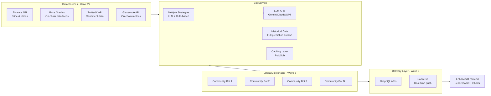
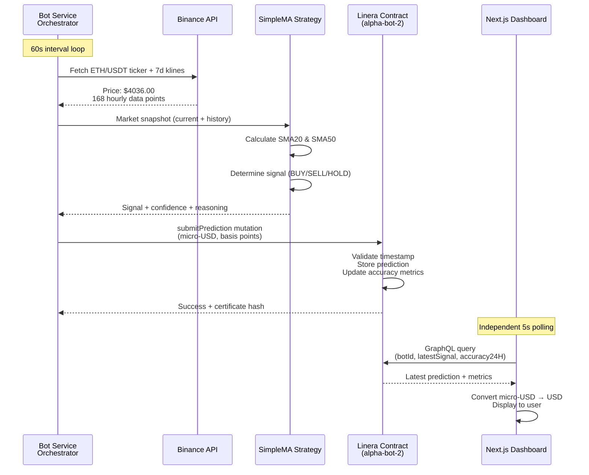

# AlphaBot Architecture Blueprint

## Context & Goals
- Deliver transparent on-chain ETH prediction bots with verifiable track records.
- **Wave 1 Status:** ✅ Complete - Single bot with live predictions, on-chain storage, working dashboard.
- Design for incremental expansion to five bots, shared infrastructure, and low-latency notifications.

## Implementation Status (Wave 1 Complete)
- ✅ Linera microchains host bot state and expose auto-generated GraphQL APIs.
- ✅ Bot service (Node.js) handles market data aggregation from Binance and writes predictions to Linera.
- ✅ SimpleMA strategy (SMA20/SMA50 crossover) generates deterministic predictions.
- ✅ Next.js frontend consumes Linera GraphQL with native fetch for compatibility.
- ⏳ Wave 2: LLM API integration (Gemini/Claude/GPT), PostgreSQL for historical data.
- ⏳ Wave 3: Socket.io for real-time push updates, community multi-bot platform.
- ✅ Makefile-driven dev flow (linera localnet, bot-service, frontend).

## High-Level System (Wave 1 Implementation)

```mermaid
flowchart LR
    subgraph DataSources[Data Sources - Wave 1]
        Binance[Binance API<br/>ETH/USDT Price & Klines]
    end

    subgraph BotService[Bot Service - Node.js/TypeScript]
        Fetch[BinanceFetcher<br/>Hourly kline data]
        Strategy[SimpleMA Strategy<br/>SMA20/SMA50 Crossover]
        Orchestrator[Orchestrator<br/>60s prediction cycle]
        LineraClient[Linera Client<br/>GraphQL mutations]
    end

    subgraph Linera[Linera Microchain - Wave 1]
        BotContract[Bot State Contract<br/>Single Bot: alpha-bot-2]
        State[On-Chain State<br/>Latest prediction + 24h accuracy]
    end

    subgraph API[Delivery Layer]
        GraphQL[Auto-generated GraphQL<br/>Linera service port 8081]
    end

    subgraph Frontend[Next.js Frontend - Wave 1]
        Dashboard[Bot Dashboard<br/>Prediction display + metrics]
        Polling[5s Auto-refresh<br/>Native fetch client]
    end

    Binance --> Fetch
    Fetch --> Orchestrator
    Orchestrator --> Strategy
    Strategy --> LineraClient
    LineraClient --> BotContract
    BotContract --> State
    State --> GraphQL
    GraphQL --> Polling
    Polling --> Dashboard

    style BotService fill:#e1f5ff
    style Linera fill:#fff4e1
    style Frontend fill:#e8f5e9
```

## Future Architecture (Wave 2+)

## On-Chain Price Oracles (Future Enhancement)

**What are Price Oracles?**
Decentralized data feeds that provide reliable, tamper-proof price data directly on-chain. They aggregate data from multiple exchanges and provide cryptographically signed price updates.

**Why Consider On-Chain Oracles? (Wave 2+ Option)**

**Current (Wave 1):**
- Bot service fetches price from Binance API (off-chain)
- Bot service submits prediction to Linera (centralized trust point)
- Users must trust our bot service to report prices honestly

**With On-Chain Oracles (Wave 2+ Option):**
- Oracle provides ETH price directly on Linera chain
- Bot contracts can read oracle price on-chain (decentralized)
- Users can verify predictions against same oracle price
- Eliminates "bot operator controls the price data" concern

**Use Cases**:
1. **Prediction Resolution**: Contract reads actual ETH price from oracle to compute accuracy
2. **Trustless Verification**: Anyone can verify bot accuracy using same oracle data
3. **Cross-Chain Predictions**: Support predictions on multiple chains with unified price source
4. **Timestamped Prices**: Oracle provides block-specific prices for exact prediction windows

**Trade-offs**:
- ✅ **Pro**: Fully decentralized, tamper-proof price verification
- ✅ **Pro**: No reliance on centralized bot service for price data
- ⚠️ **Con**: Oracle fees (gas costs for reading oracle data)
- ⚠️ **Con**: Update frequency limited by oracle schedule (usually 1-5 min updates)
- ⚠️ **Con**: Requires Linera to support oracle integration

**Wave 1 Decision**: Deferred to Wave 2+
- Wave 1 uses Binance API (simpler, free, sufficient for MVP)
- Wave 2+ can evaluate oracle options as enhancement
- Community bots in Wave 3 can choose their own price sources

## Prediction Flow (Wave 1 - Actual Implementation)

## Component Responsibilities (Wave 1)
- **Bot Service**:
  - Orchestrates 60s prediction cycles
  - Fetches real-time market data from Binance (price, volume, historical klines)
  - Executes SimpleMA strategy (SMA20/SMA50 crossover)
  - Submits predictions to Linera via GraphQL mutations
  - Handles fixed-point conversions (USD ↔ micro-USD, % ↔ basis points)

- **SimpleMA Strategy** (`bot-service/src/strategies/simple-ma.ts`):
  - Pluggable strategy interface
  - Calculates 20-period and 50-period simple moving averages
  - Generates BUY signal when SMA20 > SMA50 * 1.02 (spread > 2%)
  - Generates SELL signal when SMA20 < SMA50 * 0.98 (spread < -2%)
  - Returns HOLD for neutral conditions (-2% ≤ spread ≤ 2%)
  - Dynamic confidence: 0.5-0.9 based on spread magnitude
  - Provides human-readable reasoning text

- **Linera Contract**:
  - Stores latest prediction only (gas-efficient)
  - Validates timestamp monotonicity (prevents backdating)
  - Computes rolling 24h accuracy metrics (RMSE, directional accuracy)
  - Exposes auto-generated GraphQL API
  - Fixed-point arithmetic for deterministic calculations

- **Frontend (Next.js)**:
  - Displays bot state, latest prediction, accuracy metrics
  - Polls Linera GraphQL every 5 seconds
  - Converts micro-USD to USD for display
  - Manual refresh button for immediate updates
  - Error handling for connection issues

## Future Components (Wave 2+)
- **LLM Strategy Engine**: API-based (Gemini/Claude/GPT) for AI-powered predictions
- **PostgreSQL**: Full historical prediction archive and analytics
- **Redis**: Caching layer and pub/sub for multi-bot coordination
- **Socket.io Gateway**: Real-time push notifications to frontend
- **Leaderboard Service**: Multi-bot performance aggregation and ranking

## Data Management (Wave 1)
- **On-Chain (Linera)**:
  - Latest prediction only (gas-efficient)
  - Rolling 24h accuracy metrics (RMSE, directional accuracy, total predictions)
  - Follower count (future Wave 2+)
  - All data stored with fixed-point arithmetic (micro-USD, basis points)

- **Off-Chain (Future Wave 2+)**:
  - PostgreSQL: Full historical predictions, analytics queries
  - Redis: Caching layer for market data, pub/sub for events
  - Reasoning text limited to <512 chars on-chain

- **Data Flow**:
  - Bot service → Linera (write predictions)
  - Frontend → Linera GraphQL (read latest state)
  - No centralized database in Wave 1 (blockchain as source of truth)

## Security & Compliance (Wave 1)
- ✅ Linera transactions signed with wallet keypair
- ✅ Binance API data validated with Zod schemas
- ✅ Fixed-point arithmetic prevents float precision issues
- ✅ Timestamp validation prevents backdating predictions
- ✅ Environment variables for API keys (dotenv)
- ⏳ Wave 2: Dedicated bot signing keys, key rotation
- ⏳ Wave 2+: Rate limiting for follow actions
- ⏳ Wave 3: Wallet signature auth for user interactions

## Observability (Wave 1)
- ✅ Console logging in bot service (timestamp, price, signal, reasoning)
- ✅ Error handling and retry logic (exponential backoff)
- ✅ Frontend error boundaries for GraphQL failures
- ⏳ Wave 2: Structured logging (pino/winston)
- ⏳ Wave 2: Metrics endpoint (fetch latency, strategy performance)
- ⏳ Wave 3: Sentry integration for error tracking

## Milestone Breakdown

### Wave 1 (✅ Complete)
**Goal**: Prove the core concept works end-to-end

**Delivered**:
- ✅ Linera smart contract deployed on localnet
- ✅ Bot service with Binance API integration
- ✅ SimpleMA strategy (SMA20/SMA50 crossover)
- ✅ Next.js dashboard with auto-refresh
- ✅ Fixed-point arithmetic with perfect conversion accuracy
- ✅ Complete E2E testing (6/7 tests passed)
- ✅ Documentation: README, architecture, E2E guide

**Tech Stack**:
- Contracts: Rust + Linera SDK
- Bot Service: Node.js + TypeScript + Binance API
- Frontend: Next.js 16 + TailwindCSS + native fetch GraphQL
- Testing: Vitest (bot-service), Cargo test (contracts)

### Wave 2 (Next - 2-3 weeks)
**Goal**: Add LLM-powered predictions via API

**Planned**:
- 🎯 LLM-powered predictions via API (Google Gemini, OpenAI, or Anthropic Claude)
- 🎯 Enhanced reasoning text generation from LLM
- 🎯 PostgreSQL for full historical data storage
- 🎯 Strategy comparison dashboard (SimpleMA vs LLM)
- 🎯 Accuracy charts (RMSE, directional accuracy over time)
- 🎯 Follow/unfollow button
- 🎯 WebSocket notification preview

**Tech Additions**:
- LLM API integration (Gemini API preferred for cost/performance)
- PostgreSQL for analytics and historical predictions
- Redis for caching and rate limiting
- Prompt engineering for market analysis

**Why LLM APIs over Local Models**:
- ✅ No local GPU/compute requirements
- ✅ Latest models with better reasoning capabilities
- ✅ Easier to scale and deploy
- ✅ Lower maintenance (no model updates, quantization, etc.)
- ⚠️ API costs (budget: ~$10-20/month for hourly predictions)

### Wave 3 (Future - Community Multi-Bot Platform)
**Goal**: Open platform for community-contributed bot strategies

**Vision**:
- 🔮 **Multiple independent bots**, each running different strategies
- 🔮 **Community contributions**: Anyone can deploy a bot with their strategy
- 🔮 **Strategy diversity**: Momentum, sentiment, fundamental, ensemble, contrarian, custom algorithms
- 🔮 **Fair competition**: All bots compete on same data, transparent track records
- 🔮 **Leaderboard**: Ranked by accuracy metrics (directional %, RMSE, win rate)
- 🔮 **Real-time updates**: Socket.io notifications (<2s latency)
- 🔮 **Copy-trade button**: Follow top-performing bots (requires @linera/client)
- 🔮 **Bot marketplace**: Discovery, filtering, performance comparison

**Bot Examples**:
- **Technical Analysis Bots**: RSI, MACD, Bollinger Bands, Volume analysis
- **Sentiment Bots**: Twitter/Reddit sentiment, Fear & Greed index
- **On-Chain Bots**: Whale watching, exchange flows, network metrics
- **Fundamental Bots**: ETH2 staking data, DeFi TVL, developer activity
- **Hybrid Bots**: LLM + technical indicators, ensemble methods
- **Community Custom Bots**: Anyone can contribute novel strategies

**Platform Features**:
- Bot registration and verification
- Standardized strategy interface
- Performance metrics and rankings
- Historical backtesting data
- Bot deployment CLI/SDK

### Wave 4 (Future - Community Bot Builder)
**Goal**: Enable users to create custom bots through prompt engineering and MCP data integration

**Vision**: Transform users from bot followers to bot creators by providing a no-code interface for building AI-powered trading strategies.

**Core Features**:
- 🔮 **Prompt-Based Bot Creation**: Users customize LLM system prompts to define their strategy logic
- 🔮 **MCP Data Marketplace**: Connect bots to additional data sources via community MCP servers
  - Sentiment data (Twitter, Reddit, Fear & Greed Index)
  - On-chain metrics (Glassnode, Whale Alert)
  - News feeds and economic calendars
  - Custom user-contributed data sources
- 🔮 **Prompt Templates**: Pre-built templates for common strategies (momentum, mean reversion, sentiment-driven)
- 🔮 **Backtesting Interface**: Test custom prompts against historical data before deployment
- 🔮 **One-Click Deployment**: Publish user bots to personal Linera microchains
- 🔮 **Community Sharing**: Fork successful prompts, earn reputation from followers

**Example User Flow**:
1. Select a prompt template (e.g., "Sentiment + Technical Analysis")
2. Customize instructions (e.g., "Focus on Twitter sentiment, ignore Reddit")
3. Choose MCP data sources to include
4. Backtest against 30 days of historical data
5. Deploy bot to Linera microchain
6. Track performance and iterate on prompt

**Key Benefits**:
- Lowers barrier to entry (no coding required)
- Encourages strategy experimentation and innovation
- Expands bot ecosystem through user creativity
- Creates network effects (more bots → more data → better insights)

## Resolved Questions (Wave 1)
- ✅ **Follower relationships**: Decided to defer to Wave 2+, store count only on-chain
- ✅ **Market data source**: Binance API chosen for reliability and free hourly data
- ✅ **GraphQL client**: Native fetch works better than graphql-request for Linera
- ✅ **Fixed-point precision**: Micro-USD (6 decimals) and basis points (2 decimals) sufficient

## Open Questions (Wave 2+)

### Wave 2 Questions
- 💭 **LLM API choice**: Gemini (cost-effective), Claude (reasoning), or GPT (proven)?
- 💭 **LLM accuracy target**: What's acceptable? Aim for 55%+ directional accuracy
- 💭 **Prompt engineering**: What market data to include? Technical indicators? Sentiment?
- 💭 **API rate limits**: How to handle rate limits during high-frequency predictions?
- 💭 **Cost optimization**: Cache LLM responses? Batch predictions?

### Wave 3 Questions (Community Platform)
- 💭 **Bot registration**: KYC requirements? Stake deposit to prevent spam bots?
- 💭 **Strategy verification**: How to verify bot code isn't manipulating data?
- 💭 **Gas pricing**: Who pays Linera fees? Bot operators or platform?
- 💭 **Bot discovery**: How do users find good bots? Tags, categories, search?
- 💭 **Performance tracking**: Real-time vs daily aggregation? Backfill historical data?
- 💭 **Bot rewards**: Revenue share for top-performing bots? Subscription model?
- 💭 **Dispute resolution**: What if bot operator disputes accuracy calculation?
- 💭 **Data sources**: Allow bots to use different price feeds? Or enforce standard?

## Next Steps (Wave 2)
1. 🎯 Set up LLM API integration (Gemini/Claude/GPT)
2. 🎯 Implement LLM strategy with prompt engineering
3. 🎯 Set up PostgreSQL schema for historical predictions
4. 🎯 Build strategy comparison interface (SimpleMA vs LLM)
5. 🎯 Add accuracy charting (recharts or victory)
6. 🎯 Implement follow/unfollow functionality
7. 🎯 Test LLM strategy vs SimpleMA performance (target 55%+ accuracy)
8. 🎯 Optimize API latency and implement rate limiting
9. 🎯 Add cost monitoring for LLM API usage
10. 🎯 WebSocket notification preview
