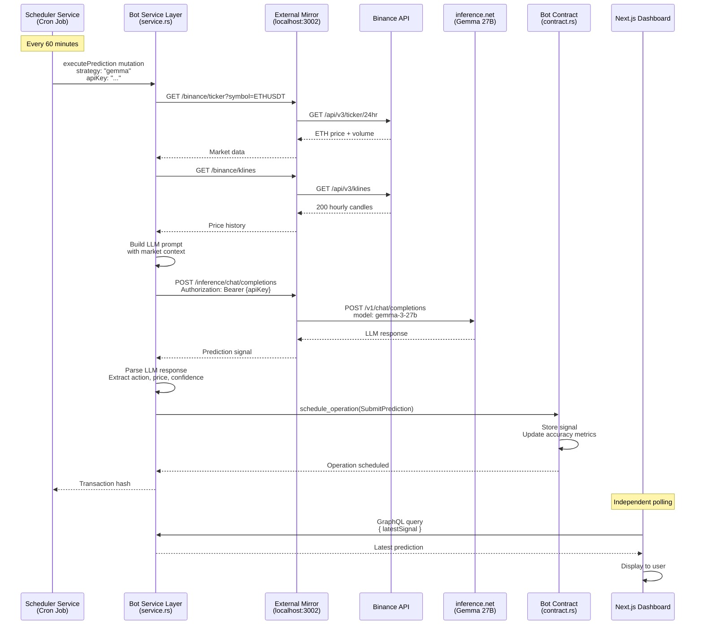

# AlphaBot Architecture Blueprint

## Context & Goals
- Deliver transparent on-chain ETH prediction bots with verifiable track records.
- **Wave 1 Status:** ✅ Complete - LLM predictions working end-to-end with on-chain storage and live dashboard.
- **Wave 2 Status:** ⚙️ In Progress - Multi-bot platform with scheduler service and analytics.
- Design follows Linera design patterns: Personal Chains for Scaling + Just-in-Time Oracles.

## Implementation Status

### Wave 1 (✅ Complete)
- ✅ Service.rs with HTTP requests following atoma-demo pattern
- ✅ Market data fetched directly from contract service layer (Binance API)
- ✅ LLM inference via inference.net API (Gemma 3 27B)
- ✅ External-service-mirror as localhost HTTP proxy (bypasses genesis config restrictions)
- ✅ GraphQL mutation triggers predictions on-demand
- ✅ Next.js frontend displays predictions with live updates
- ✅ Full E2E flow validated: Frontend → GraphQL → Contract → Mirror → LLM → On-chain storage

### Wave 2 (⚙️ In Progress)
- 🔄 **Scheduler service**: Just-in-Time Oracle pattern for hourly predictions
- ⏳ **Multi-bot deployment**: Multiple strategies on personal chains
- ⏳ **PostgreSQL**: Full historical prediction archive and analytics
- ⏳ **Accuracy dashboard**: RMSE, directional accuracy, win rate charts

### Wave 3 (⏳ Future)
- ⏳ **Atoma Network integration**: Decentralized LLM inference (pending API access)
- ⏳ **Walrus integration**: Prompt storage and versioning
- ⏳ **Socket.io**: Real-time push updates
- ⏳ **Bot marketplace**: No-code bot builder with prompt engineering UI

## High-Level Architecture (Current - Wave 1 Complete)

### Linera Design Patterns Applied

**Pattern 3: Personal Chains for Scaling**
- Each bot runs on dedicated microchain
- Computationally intensive work (HTTP requests, LLM inference) happens in service layer
- Scales horizontally as new bots are added

**Pattern 5: Just-in-Time Oracles**
- Scheduler service = off-chain oracle client
- Triggers predictions on-demand (hourly schedule)
- Contract fetches real-time data via HTTP

```mermaid
flowchart TB
    subgraph Scheduler[Scheduler Service - Just-in-Time Oracle]
        Cron[Cron Job<br/>Every 60 minutes]
        Trigger[GraphQL Mutation Trigger<br/>executePrediction]
    end

    subgraph Mirror[External Service Mirror<br/>Localhost HTTP Proxy - Port 3002]
        BinanceProxy[/binance/ticker<br/>/binance/klines]
        InferenceProxy[/inference/chat/completions<br/>Transparent header forwarding]
    end

    subgraph BotChain[Bot Microchain - Personal Chain Pattern]
        Service[Service Layer<br/>service.rs]
        MarketFetch[Fetch Market Data<br/>HTTP to localhost:3002]
        LLMCall[Call LLM<br/>HTTP to localhost:3002]
        Contract[Contract Layer<br/>contract.rs]
        State[On-Chain State<br/>Latest signal + 24h accuracy]
    end

    subgraph External[External APIs]
        Binance[Binance API<br/>api.binance.com]
        Inference[Inference.net<br/>api.inference.net<br/>Gemma 3 27B]
    end

    subgraph Frontend[Next.js Frontend - Port 3001]
        Dashboard[Bot Dashboard<br/>Prediction display]
        GraphQLQuery[GraphQL Query<br/>5s polling]
    end

    Cron --> Trigger
    Trigger --> Service
    Service --> MarketFetch
    MarketFetch --> BinanceProxy
    BinanceProxy --> Binance
    Binance --> BinanceProxy
    BinanceProxy --> MarketFetch
    MarketFetch --> LLMCall
    LLMCall --> InferenceProxy
    InferenceProxy --> Inference
    Inference --> InferenceProxy
    InferenceProxy --> LLMCall
    LLMCall --> Contract
    Contract --> State
    State --> GraphQLQuery
    GraphQLQuery --> Dashboard

    style Scheduler fill:#e1f5ff
    style BotChain fill:#fff4e1
    style Mirror fill:#f3e5f5
    style Frontend fill:#e8f5e9
```

## Component Responsibilities (Wave 1)

### Scheduler Service (Just-in-Time Oracle)
**Purpose:** Off-chain oracle that triggers predictions on schedule
**Technology:** Node.js + node-cron
**Responsibilities:**
- Runs cron job every 60 minutes
- Calls `executePrediction` GraphQL mutation
- Passes strategy name and API key
- Can manage multiple bots with different strategies
- Bot owner runs their own scheduler (decentralized)

**Scaling Pattern:**
- Each bot creator deploys their own scheduler instance
- Scheduler lightweight (~50 lines of code)
- Docker-compose ready for easy deployment

### Bot Microchain (Personal Chain Pattern)
**service.rs - Service Layer:**
- Handles GraphQL queries and mutations
- Implements `executePrediction` mutation
- Fetches market data via HTTP (Binance API)
- Calls LLM inference via HTTP (inference.net)
- Parses LLM response and extracts signal
- Schedules operation to store prediction

**contract.rs - Contract Layer:**
- Executes `SubmitPrediction` operation
- Stores latest signal on-chain
- Computes rolling 24h accuracy metrics
- Validates timestamp monotonicity

**Why Two Layers:**
- Service layer = read-only GraphQL, can make HTTP requests
- Contract layer = state modifications, deterministic execution
- Follows Linera SDK design pattern

### External Service Mirror
**Purpose:** Localhost HTTP proxy to bypass genesis config restrictions
**Technology:** Node.js + Express
**Port:** 3002
**Endpoints:**
- `GET /binance/ticker?symbol=ETHUSDT` → Binance 24hr ticker
- `GET /binance/klines?symbol=ETHUSDT&interval=1h&limit=200` → Price history
- `POST /inference/chat/completions` → LLM inference

**Key Feature:** Transparent Authorization header forwarding
- API key passed from service.rs
- Mirror forwards header to external API
- No API key storage in proxy

### Frontend (Next.js)
**Purpose:** User-facing dashboard
**Technology:** Next.js 16 + TailwindCSS + shadcn/ui
**Responsibilities:**
- Display latest prediction and reasoning
- Show bot accuracy metrics
- Poll GraphQL every 5 seconds
- Convert micro-USD to USD for display
- Handle connection errors gracefully

## Prediction Flow (Wave 1 - Validated Implementation)



## Data Flow Architecture

### On-Chain (Linera Microchain)
**Storage:**
- `bot_id`: String identifier
- `latest_signal`: Option<Signal> (most recent prediction)
- `accuracy_24h`: AccuracyMetrics (rolling window)
- `follower_count`: u64 (future Wave 2+)

**Fixed-Point Arithmetic:**
- Prices stored as micro-USD (multiply by 1,000,000)
- Confidence stored as basis points (multiply by 10,000)
- Prevents floating-point precision issues

### Off-Chain (Future Wave 2+)
**PostgreSQL:**
- Full historical predictions
- Analytics aggregations
- Bot performance rankings
- Historical accuracy trends

**Redis:**
- Market data caching (reduce API calls)
- Rate limiting for predictions
- Pub/sub for multi-bot coordination

## Security Architecture

### API Key Management
**Current (Wave 1):**
- API key stored in scheduler service `.env`
- Passed via GraphQL mutation argument
- Forwarded transparently through mirror
- Never stored in contract or mirror

**Future (Wave 2+):**
- API key per bot strategy
- Encrypted at rest
- Key rotation support
- Usage monitoring and alerts

### HTTP Request Security
**Genesis Config:**
- `http_request_allow_list: ["localhost"]`
- Contracts can only call localhost
- Mirror acts as authorized gateway
- Prevents contracts from calling arbitrary URLs

### Validation
- Timestamp monotonicity (prevents backdating)
- Market data schema validation (Zod in future)
- LLM response parsing with error handling
- Fixed-point conversion validation

## Multi-Bot Scaling (Wave 2 Plan)

### One Scheduler, Multiple Bots
```typescript
// scheduler/src/bots.ts
export const BOTS = [
  {
    name: 'alphabot-gemma',
    chainId: '7c54a8eb...',
    appId: '4900f02c...',
    strategy: 'gemma',
    apiKey: process.env.INFERENCE_API_KEY
  },
  {
    name: 'alphabot-deepseek',
    chainId: '9d73b2a1...',
    appId: '3f21c8d9...',
    strategy: 'deepseek',
    apiKey: process.env.DEEPSEEK_API_KEY
  }
];

// Cron triggers all bots in parallel
cron.schedule('0 * * * *', async () => {
  await Promise.all(
    BOTS.map(bot => triggerPrediction(bot))
  );
});
```

### Personal Chain Benefits
- Each bot isolated on separate microchain
- Independent failure domains
- Parallel prediction execution
- Transparent per-bot track records
- Easy to add/remove bots

## Deployment Architecture

### Local Development
```bash
# Terminal 1: Linera network
make linera-local

# Terminal 2: Wallet
make wallet-init

# Terminal 3: External mirror
make mirror

# Terminal 4: Deploy contract
cd contracts && linera project publish-and-create bot-state

# Terminal 5: Frontend
cd frontend && pnpm dev

# Terminal 6: Scheduler (future)
cd scheduler && pnpm dev
```

### Production Deployment (Future)
**Docker Compose Stack:**
- `linera-node`: Validator node
- `external-service-mirror`: HTTP proxy
- `scheduler`: Cron-based prediction trigger
- `frontend`: Next.js dashboard
- `postgres`: Historical data (Wave 2+)
- `redis`: Caching layer (Wave 2+)

**Scaling:**
- Each bot creator runs their own scheduler
- Shared infrastructure (mirror, frontend)
- Decentralized prediction triggering
- No single point of failure

## Future Architecture (Wave 2+ - Decentralized Inference)

**Vision:** Fully decentralized bot creation platform

**Components:**
- **Walrus Storage**: Immutable prompt artifacts
- **Atoma Network**: Distributed LLM inference nodes
- **Linera Microchains**: Bot state and track records
- **Bot Builder UI**: No-code prompt engineering
- **Community Marketplace**: Discover and follow top bots

**User Flow:**
1. Creator designs bot via prompt engineering
2. Prompt stored on Walrus (content-addressed)
3. Bot deployed to personal Linera microchain
4. Scheduler triggers hourly predictions
5. Contract calls Atoma for decentralized inference
6. Results verified and stored on-chain
7. Users follow bots with best track records

**Key Innovation:** No coding required, fully decentralized inference, transparent track records

See `docs/DECENTRALIZED_INFERENCE_ARCHITECTURE.md` for full details.

## Design Decisions & Trade-offs

### Why External Service Mirror?
**Problem:** Linera genesis config doesn't allow HTTP to external domains
**Solution:** Localhost proxy as authorized gateway
**Trade-off:** Adds deployment complexity but enables HTTP in service layer
**Alternative Considered:** Fix genesis config (harder to maintain across networks)

### Why Scheduler Service?
**Problem:** Linera uses on-demand block creation, no automatic scheduling
**Solution:** Off-chain cron service triggers mutations
**Trade-off:** External dependency but follows Just-in-Time Oracle pattern
**Alternative Considered:** Frontend-triggered (unreliable), Linera Keepers (doesn't exist yet)

### Why Service Layer for HTTP?
**Problem:** Need to call external APIs for market data and LLM
**Solution:** Use service.rs with `runtime.http_request()`
**Trade-off:** None - follows official atoma-demo pattern
**Alternative Considered:** External bot service (less decentralized, deprecated)

### Why Personal Chains?
**Problem:** Need isolated execution per bot strategy
**Solution:** Each bot on dedicated microchain
**Trade-off:** More chains to manage but better isolation and transparency
**Alternative Considered:** Single chain with multiple bots (less scalable)

## Performance Characteristics

### Latency Budget
- Binance API: ~100-200ms
- Binance klines: ~300-500ms
- LLM inference: ~2-5 seconds (Gemma 27B)
- Contract execution: ~50-100ms
- **Total prediction cycle: ~3-6 seconds**

### Throughput
- Current: 1 prediction per hour per bot
- Wave 2+: 5 bots = 5 predictions per hour
- Each bot on separate chain = parallel execution

### Cost
- Binance API: Free (rate limited)
- Inference.net: ~$0.01 per prediction (Gemma 27B)
- Linera gas: Minimal (localnet free, mainnet TBD)
- **Estimated: ~$7-10/month per bot for hourly predictions**

## Next Steps (Wave 2)

1. ✅ Validate LLM integration (Complete)
2. 🔄 Create scheduler service (In Progress)
3. ⏳ Deploy multiple bot strategies
4. ⏳ Add PostgreSQL for historical data
5. ⏳ Build accuracy dashboard
6. ⏳ Implement follow/unfollow
7. ⏳ Performance optimization and monitoring

## References

- [Linera Design Patterns](https://github.com/linera-io/linera-documentation/blob/main/src/developers/core_concepts/design_patterns.md)
- [Atoma Demo (HTTP in Service Layer)](https://github.com/linera-io/atoma-demo)
- [Linera SDK Documentation](https://docs.linera.io/)
